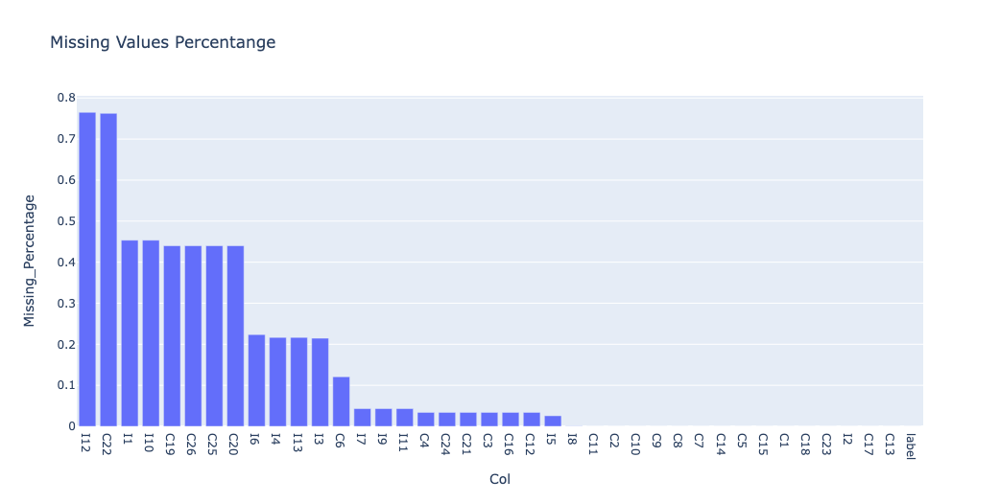
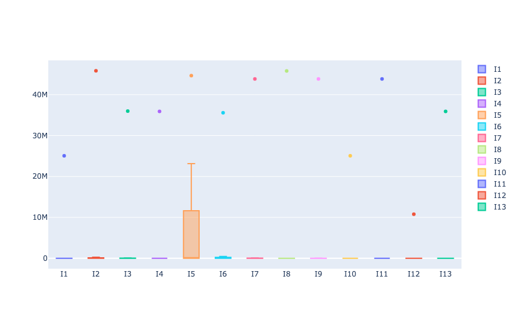
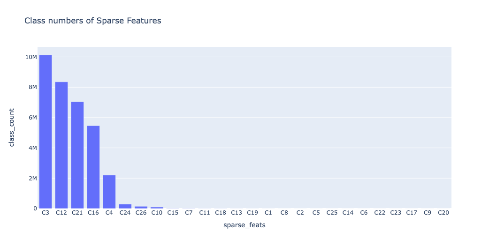
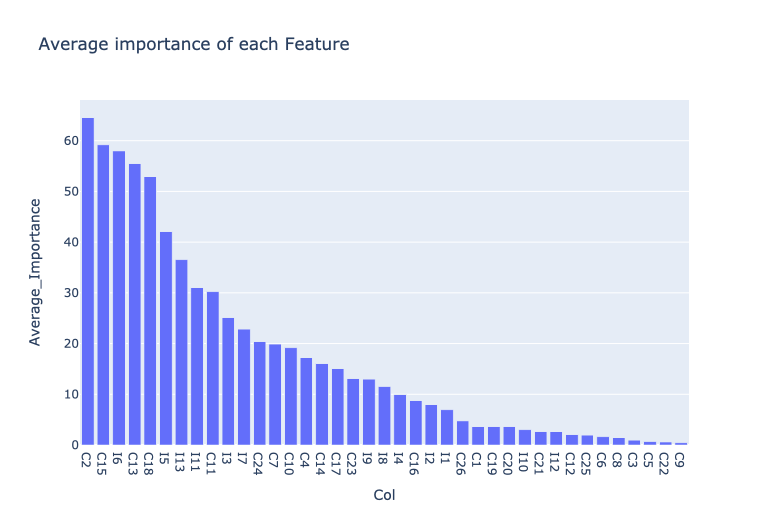
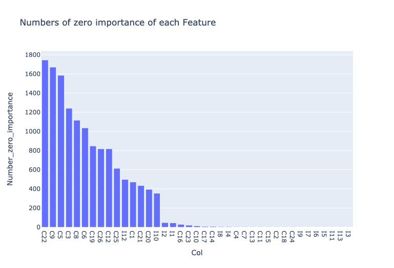
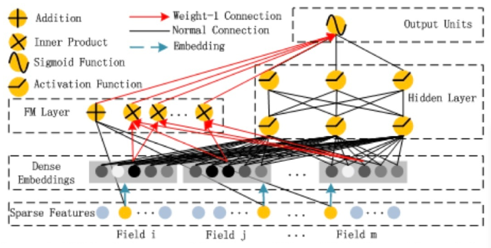

# Predict click-through rates on display ads

## Slides

- https://kuiming.github.io/criteo_ctr/slide/output/index.html#/

## Submission

- **[csv file](https://drive.google.com/file/d/1BXTTNyeQsWSITXmNcyEktBitVXHxkLyB/view?usp=sharing)**

## 探索資料分析


- 資料欄位
    - 數值型資料：I1~I14
    - 類別型資料： C1~C27
- 資料量
    - train.txt： 45840617 筆，11.15 GB
    - text.txt：6042135 筆，1.46 GB
- Missing Value 比例高

- 數值型資料分布較廣

- 類別型資料部分欄位的類別眾多



## 第一階段嘗試- LightGBM
由於 LightGBM 可以直接處理類別型資料，並且對於缺失值有良好的處理方式。無需事先將類別型特徵轉換成整數（如透過 Label Encoding），只需要將其類型設定為 'category' 即可。而這次所需要處理的資料量過大，類別也很多，要一一做 encoding 會需要較多資源，所以，一開始先嘗試使用 LightGBM。

### 特徵工程
只針對類別型資料轉換成 'category'。

### 模型調整

- 先以小部分樣本針對以下幾項參數做 Grid search，已取得較好的參數：
    - learning_rate：這是梯度提升的學習率。較小的學習率需要更多的迭代次數，但可能會達到更好的性能。
    - feature_fraction：這是在每一次迭代中，隨機選擇的特徵的比例。使用小於 1 的值可以防止過擬合。
    - num_leaves：這是決策樹中葉子的最大數量。增加此值會使模型變得更複雜，可能提高訓練集的性能，但也可能引起過度擬合。
- 取得上述參數後，拿出一半的資料，分批做訓練，並且蒐集 Feature Importance，以利後續調整。
- Feature Importance：
    - 由於數據量過於龐大，在資源有限的情況，可以考慮只使用重要的特徵來做訓練，以提升效率。
    - 由於是分批訓練，每次訓練都會取得 Feature Importance，Importance 越小，代表該特徵在此模型的影響力越低，可以考慮拿掉，而分批訓練可以觀察在不同的資料分布情況之下，每種特徵是否都有一定的重要性。
        - 每種特徵的平均 Importance：
        
        - 每種特徵的 Importance 為零的次數。從下圖可以看出有些特徵為零的次數很多，在很多情況之下，是沒有影響力的。
        
- 同時考慮 Feature Importance 和 缺值的情況，將 Feature Importance 為零次數大於 100，且缺值比例超過 40% 的特徵值移除，再試著訓練一次。

### 結果
從 Kaggle 上的 Private 和 Public Score 得知，不管是否移除特徵，其分數都在0.54左右，代表這些特徵的確沒有太多影響，而第一階段的做法效果有限，應該可以考慮其他做法。

## 第二階段嘗試- DeepFM
DeepFM（Deep Factorization Machine）是一種深度學習模型，專門設計來處理這種包含大量類別型特徵的問題。可以利用深度學習的方式自動學習不同特徵之間的交互效應。例如，廣告的類別和用戶的地理位置可能會共同影響廣告被點擊的機率。



在此階段需要針對類別型資料做 Label Encoding，可能會耗費大量資源，所以決定購買 Colab Pro+，直接使用 Nvidia A100 和 83.5 GB的記憶體。

### 特徵工程
- 依照上述 Feature Importance 和缺值的情況，移除部分特徵值：`'I10', 'I12', 'C19', 'C20', 'C22', 'C25', 'C26'`
- 針對數值型資料
    - 以每個特徵的眾數補缺值：這些數值可能代表某些事件或行為的次數，可以考慮以大多數的情況去補植。
    - 由於數值範圍太廣，可以考慮取 log ，以縮小數值範圍。
- 針對類別型資料
    - 以 "-1" 補缺值：由於是類別型資料，缺值可能代表使用者沒有這樣的類別，可以考慮新增一個類別 "-1" 來表示。
    - 針對類別型資料做 Label Encoding

### 模型訓練
- 此次訓練使用 tensorflow Keras。在
- 模型訓練時，做了以下兩個設定，以確保模型順利學習
    - Learning Rate Reducing：Loss 在 10 個 epoch 以內沒有下降，便將 Learning Rate 減半，直到 1e-7。
    - Stop Rule：在 50 個 epoch 以內沒有進步，則停下訓練，以免浪費資源。
- 由於訓練資料龐大，直接放入模型做訓練，可能會有記憶體不足的問題，所以使用 Data Generator，讓資料分批放入。

### 後續調整
- 第一次完成訓練，產生`test.txt`的預測結果時，發現測試資料的類別型資料會有之前不曾出現過的類別，暫時先以眾數取代，以完成第一次 submision。
- 為了在訓練時考慮未來會有未知的類別產生，在資料前處理時，所有類別強行加入"-1"，作為未知類別。而之後只要有新的類別產生，便直接以"-1"取代。

### 結果
Private 和 Public Score 下降至 0.468 與 0.469。


---


Training
```bash
python3 training.py -m model.hdf5 -d train.txt -e encoder.pkl
```

Prediction
```bash
python3 prediction.py -m model.hdf5 -d train.txt -e encoder.pkl -r submission.csv
```

